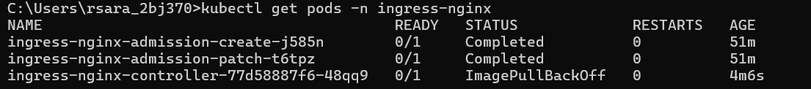
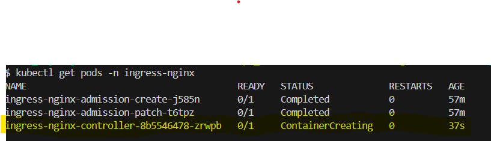
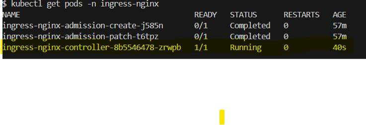
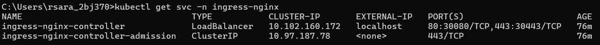
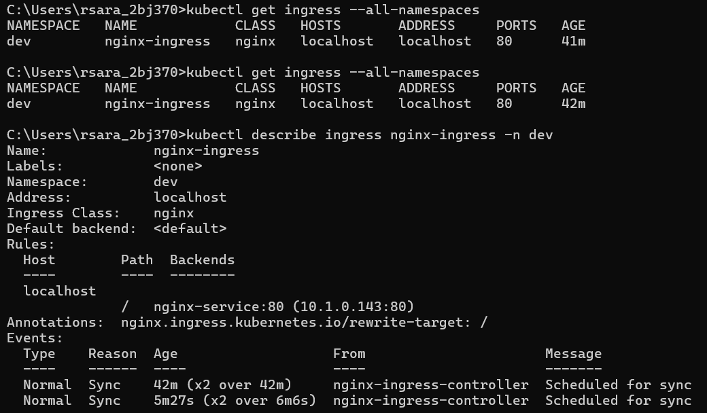

# What is an Ingress Controller?

An Ingress Controller is a Kubernetes component that manages access to services from outside the Kubernetes cluster.

 It uses Ingress resources to define routing rules.

Kubernetes does not include a built-in Ingress Controller. You must install one (e.g., NGINX, Traefik, HAProxy, etc.).

# What is NGINX Ingress Controller?

The NGINX Ingress Controller is one of the most widely used Ingress Controllers. It is based on the NGINX web server

 and is developed and maintained by the Kubernetes SIG-NGINX team.

# There are two versions:

       Type	                                          Maintained By	                            Description
NGINX Ingress Controller	                      Kubernetes SIG (open source)	    Default and popular in most setups 
NGINX Plus Ingress Controller	                  F5 (commercial)	                Advanced features, requires license

# When to Use NGINX Ingress Controller

You need a lightweight, production-grade reverse proxy.

You want to manage access via domain names (host-based routing).

You want fine-grained traffic control using annotations.

You're running on Docker Desktop, Minikube, or any K8s that doesn’t offer a built-in Ingress Controller.

You prefer open source, stable, and community-supported options.

# When Not to Use NGINX Ingress Controller

You are in a cloud-managed K8s environment (like GKE, AKS, EKS) where a cloud-native ingress (e.g., AWS ALB, Azure Application Gateway) is available.

You need TCP/UDP proxying (NGINX Ingress only supports HTTP/HTTPS unless heavily customized).

You want dynamic config reloads or need service mesh-level routing (consider Traefik or Istio instead).

# Create Namespaces

kubectl apply -f namespace.yaml

# Deploy NGINX Ingress Controller

kubectl apply -f nginx-ingress-controller.yaml

# Expose the Ingress Controller (NodePort)

kubectl apply -f nginx-ingress-service.yaml

# Deploy a Sample NGINX App

kubectl apply -f nginx-app.yaml

# Create Ingress Resource

 kubectl apply -f nginx-ingress-rule.yaml

# Issue 1

error validating "nginx-ingress-controller.yaml": error validating data: kind not set

solution :

update ingress controler and servcie yaml file

# issue 2

after updating its show below issue 

kubectl apply -f nginx-ingress-controller.yaml
The Deployment "ingress-nginx-controller" is invalid: spec.selector: Invalid value: v1.LabelSelector{MatchLabels:map[string]string{"app":"ingress-nginx"}, MatchExpressions:[]v1.LabelSelectorRequirement(nil)}: field is immutable

# Solution:

# Why This Happened:

Already applied the Deployment earlier with a different selector, and now you're applying it again with a changed selector (app: ingress-nginx), OR

You accidentally edited the selector labels in the YAML and re-applied.

# Solution Options:

Option 1: Delete the Existing Deployment and Recreate

kubectl delete deployment ingress-nginx-controller -n ingress-nginx

kubectl apply -f nginx-ingress-controller.yaml

# Verify Ingress Controller is Running

kubectl get pods -n ingress-nginx

issue imagepullbackoff

# solution

Update your Deployment YAML

# Re-apply the fixed configuration

kubectl delete deployment ingress-nginx-controller -n ingress-nginx

kubectl apply -f nginx-ingress-controller.yaml

# issue (Error and crashloopBackup)

kubectl get pods -n ingress-nginx

ingress-nginx-controller-8b5546478-zrwpb   0/1     CrashLoopBackOff   6 (61s ago)   7m21s

ingress-nginx-controller-8b5546478-zrwpb   0/1     Error       6 (2m55s ago)   6m33sclear

kubectl describe pod ingress-nginx-controller-8b5546478-zrwpb -n ingress-nginx

Events:
  Type     Reason     Age                     From               Message
  ----     ------     ----                    ----               -------
  Normal   Scheduled  9m7s                    default-scheduler  Successfully assigned ingress-nginx/ingress-nginx-controller-8b5546478-zrwpb to docker-desktop
  Normal   Pulling    9m6s                    kubelet            Pulling image "registry.k8s.io/ingress-nginx/controller:v1.10.0"
  Normal   Pulled     8m29s                   kubelet            Successfully pulled image "registry.k8s.io/ingress-nginx/controller:v1.10.0" in 37.142297884s
  Normal   Created    6m52s (x5 over 8m29s)   kubelet            Created container controller
  Normal   Started    6m52s (x5 over 8m29s)   kubelet            Started container controller
  Normal   Pulled     6m52s (x4 over 8m28s)   kubelet            Container image "registry.k8s.io/ingress-nginx/controller:v1.10.0" already present on machine
  Warning  BackOff    3m58s (x22 over 8m26s)  kubelet            Back-off restarting failed container

# What This Means:

This typically happens when:

The container starts but exits with an error.

Something in the configuration is incorrect.

Required resources (like ConfigMap, ServiceAccount, RBAC) are missing.

# Troubleshoot Step-by-setups

Check Pod Logs

kubectl logs -n ingress-nginx ingress-nginx-controller-8b5546478-zrwpb

NGINX Ingress controller
  Release:       v1.10.0
  Build:         71f78d49f0a496c31d4c19f095469f3f23900f8a
  Repository:    https://github.com/kubernetes/ingress-nginx
  nginx version: nginx/1.25.3

-------------------------------------------------------------------------------

W0523 07:22:32.280985       7 client_config.go:618] Neither --kubeconfig nor --master was specified.  Using the inClusterConfig.  This might not work.
I0523 07:22:32.281266       7 main.go:205] "Creating API client" host="https://10.96.0.1:443"
I0523 07:22:32.286210       7 main.go:249] "Running in Kubernetes cluster" major="1" minor="25" git="v1.25.2" state="clean" commit="5835544ca568b757a8ecae5c153f317e5736700e" platform="linux/amd64"
I0523 07:22:32.375815       7 main.go:101] "SSL fake certificate created" file="/etc/ingress-controller/ssl/default-fake-certificate.pem"
W0523 07:22:32.379520       7 main.go:111] No permissions to list and get Ingress Classes: ingressclasses.networking.k8s.io is forbidden: User "system:serviceaccount:ingress-nginx:default" cannot list resource "ingressclasses" in API group "networking.k8s.io" at the cluster scope, IngressClass feature will be disabled
F0523 07:22:32.379568       7 main.go:120] Unexpected error obtaining ingress-nginx pod: unable to get POD information (missing POD_NAME or POD_NAMESPACE environment variable

# Problems Identified

Missing RBAC Permissions

The controller is running as system:serviceaccount:ingress-nginx:default, which does not have permission to read IngressClasses:

# Solution: Delete and Recreate Deployment Cleanly

kubectl delete deployment ingress-nginx-controller -n ingress-nginx

kubectl apply -f https://raw.githubusercontent.com/kubernetes/ingress-nginx/controller-v1.10.0/deploy/static/provider/cloud/deploy.yaml

This time, it will successfully create everything including the correct Deployment with:

Proper env variables (POD_NAME, POD_NAMESPACE)

Correct ServiceAccount, ClusterRoles, etc.

kubectl get pods -n ingress-nginx

ingress-nginx-controller-548f6d66cc-kdkvh   1/1     Running     0          111s

kubectl get svc -n ingress-nginx

# FLow demo.local

[Client Browser / curl: http://demo.local]
               |
               v
[Ingress Controller (NGINX)] <-------> [Ingress Resource (rules)]
               |
               v
          [Service (ClusterIP)]
               |
               v
          [Pod (Deployment)]

# Summary Mapping Table

Component	                     Connects To	           How

Ingress (demo.local)	   Ingress Controller	    Via HTTP on port 80
Ingress → Service	       nginx-clusterip	        By name and port
Service → Pods	           app: nginx label	        Via label selectors
Hosts file	               demo.local → 127.0.0.1	So your browser can resolve domain to local ingress

# Example Traffic Flow

You open: http://demo.local → (your OS resolves to 127.0.0.1)

→ Ingress Controller receives it

→ Looks up Ingress rules: demo.local + "/" → nginx-clusterip:80

→ Forwards request to Service

→ Service routes to Pod

→ Pod sends response back

# File-to-Component Map

YAML File	               Resource Created	               Key Role

nginx-deployment.yaml	   Deployment + Pod	App          container

nginx-clusterip.yaml	   Service (ClusterIP)	         Connects Pod to Ingress

nginx-ingress.yaml	       Ingress resource	             Domain/path routing rules
Ingress Controller YAML	   Deployment + Service	         Listens and routes HTTP

# Get All Resources in All Namespaces

kubectl get all --all-namespaces

# List All Resource Types in Cluster

List All Resource Types in Cluster

discover everything (including ConfigMaps, Secrets, Ingress, etc.):

#  Get a Specific Resource Across All Namespaces

# All Ingresses:

kubectl get ingress --all-namespaces

# All ConfigMaps:

kubectl get configmap --all-namespaces

# All PVCs :

kubectl get pvc --all-namespaces

# View Everything with Labels, Wide Output

kubectl get all --all-namespaces -o wide

# View Everything with Custom Output

kubectl get all --all-namespaces -o yaml

