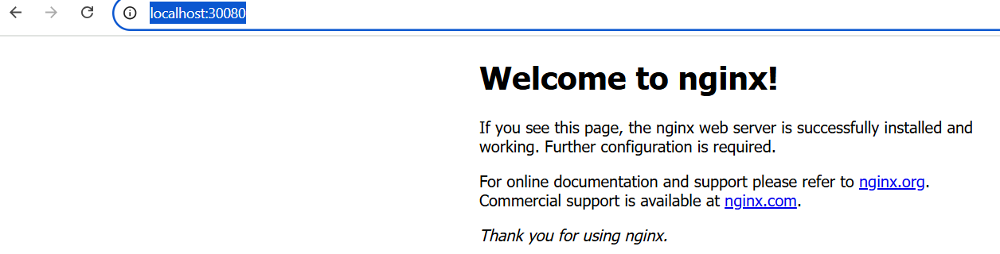
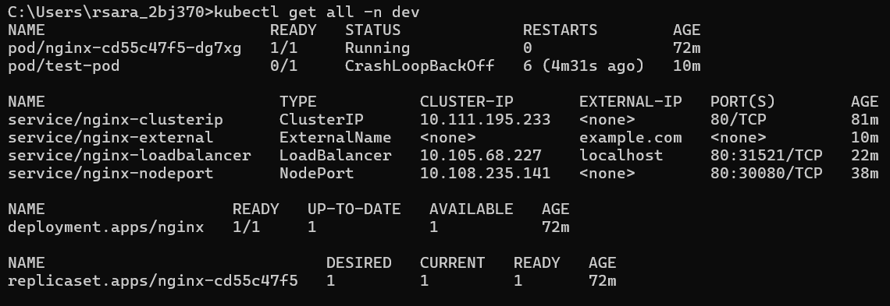

# Create name space

kubectl create namespace dev

# Apply Deployment

kubectl apply -f nginx-deployment.yaml

# Apply

kubectl apply -f nginx-clusterip.yaml

# Describe deployment 
 
kubectl describe deployment nginx -n dev

# Issue

kubectl get deployment -n dev

NAME    READY   UP-TO-DATE   AVAILABLE   AGE

nginx   0/1     0            0           18m

# Issue

Warning  ReplicaSetCreateError  16m   deployment-controller  Failed to create new replica set "nginx-cd55c47f5": Unauthorized

# This Means

Your Kubernetes control plane is unable to create pods due to an authorization issue — basically, the deployment controller doesn't have permission to create ReplicaSets (and therefore pods) in the dev namespace.

# Why?

This usually happens because:

1. RBAC (Role-Based Access Control) is enabled and your user/service account lacks the rights to create resources in dev namespace.

2. Docker Desktop Kubernetes sometimes restricts operations if the default service accounts are misconfigured.

3. You might be using a context or user with limited privileges.

# Let's try giving explicit admin rights to docker-desktop user on the dev namespace

kubectl create clusterrolebinding docker-desktop-admin-binding --clusterrole=cluster-admin --user=docker-desktop

# 
kubectl delete deployment nginx -n dev

# issue 

 namespace dev has a ResourceQuota named saas-team-quota that requires all pods to specify CPU and memory resource requests and limits.

# Solution:

kubectl get resourcequota -n dev               # List quotas

kubectl delete resourcequota saas-team-quota -n dev    # Delete quota

resourcequota "saas-team-quota" deleted

kubectl delete deployment nginx -n dev          # Clean up old deployment

# Now both deployment and clusterip yaml are update and create its working

kubectl get pods

NAME                     READY   STATUS    RESTARTS       AGE
replicaset-nginx-vk4vd   1/1     Running   1 (100m ago)   30h

# kubectl get svc -n dev

NAME              TYPE        CLUSTER-IP       EXTERNAL-IP   PORT(S)   AGE
nginx-clusterip   ClusterIP   10.111.195.233   <none>        80/TCP    15m

# Test ClusterIP service internally with a test pod:

kubectl run test-pod -n dev --rm -it --image=busybox -- /bin/sh

If you don't see a command prompt, try pressing enter.
/ # wget -qO- http://nginx-clusterip
<!DOCTYPE html>
<html>
<head>
<title>Welcome to nginx!</title>

</head>
<body>
<h1>Welcome to nginx!</h1>

If you see this page, the nginx web server is successfully installed and
working. Further configuration is required.

For online documentation and support please refer to
<a href="http://nginx.org/">nginx.org</a>. 
Commercial support is available at
<a href="http://nginx.com/">nginx.com</a>.

<em>Thank you for using nginx.</em>

</body>
</html>

# Use ClusterIP when:

# Scenarios

1. Internal communication

When you want other pods within the cluster to access a service (e.g., frontend → backend, app → database).

2. Secure internal services	

Services that shouldn't be exposed to the outside world (e.g., internal APIs, databases).

3. Microservices architecture

	When different services/pods in your app communicate with each other over DNS (http://service-name.namespace.svc.cluster.local).

4. CI/CD & internal tools

For Jenkins agents, internal monitoring (e.g., Prometheus scraping exporters), or private registries.

# Cluster ip Another testing case

ClusterIP is internal-only. Use a test pod:

 kubectl run test-pod -n dev --image=busybox --rm -it -- /bin/sh

If you don't see a command prompt, try pressing enter.

/ # wget --spider http://nginx-clusterip.dev.svc.cluster.local

Connecting to nginx-clusterip.dev.svc.cluster.local (10.111.195.233:80)
remote file exists

/ # ls
bin    dev    etc    home   lib    lib64  proc   root   sys    tmp    usr    var

## NodePort ##

kubectl apply -f nginx-nodeport.yaml

service/nginx-nodeport created

kubectl get svc -n dev

NAME              TYPE        CLUSTER-IP       EXTERNAL-IP   PORT(S)        AGE

nginx-clusterip   ClusterIP   10.111.195.233   <none>        80/TCP         45m

nginx-nodeport    NodePort    10.108.235.141   <none>        80:30080/TCP   74s

# Access NGINX in browser or curl

http://localhost:30080/

# curl with nodeport

curl http://localhost:30080

# When to Use NodePort

# Use Case	Why NodePort

1. Development / Testing:

Easy way to expose services outside the cluster on a known port.

2. Expose simple apps

Access apps in local dev setups (e.g., Docker Desktop, Minikube).

3. No Load Balancer	

When you don’t have a cloud LoadBalancer (e.g., local clusters).

4. Quick external access	

You want to test a web UI (e.g., NGINX, dashboards) via browser.

# How NodePort connects to a Deployment

The connection between a Deployment and a NodePort Service is made through labels and selectors.

# When NOT to use NodePort

In production environments —  it doesn’t provide load balancing or advanced routing.

If you have access to LoadBalancer or Ingress, they are better and more secure for external traffic.

# LoadBalancer Service Explanation

kubectl apply -f nginx-loadbalancer.yaml

# Reliable Fix: Use kubectl port-forward

This is the correct way to expose a service in Docker Desktop's Kubernetes environment:

# Port Forward
kubectl port-forward svc/nginx-loadbalancer 8080:80 -n dev

# Test in Browser or Terminal

curl http://localhost:8080

# Step 2: open in your browser:

http://localhost:8080

# When to Use LoadBalancer in Production

In cloud providers like Azure, AWS, GCP, the LoadBalancer service provisions a real external IP, e.g.:

EXTERNAL-IP: 52.112.123.45

# ExternalName Service

kubectl apply -f nginx-externalname.yaml 

# What Just Happened?

kubectl run test1-pod -n dev --image=busybox --rm -it -- /bin/sh

# Then inside the pod:

wget --spider nginx-external.dev.svc.cluster.local

# And got:

Connecting to nginx-external.dev.svc.cluster.local (96.7.128.175:80)

wget: server returned error: HTTP/1.0 400 Bad Request

# Meaning of the Result 

DNS resolution worked:   Kubernetes correctly resolved nginx-external.dev.svc.cluster.local to the service IP.

Connection to port 80 succeeded.

"400 Bad Request" came from the NGINX server itself, which means:

The request reached the pod.

But NGINX rejected the request because it expected a proper HTTP request (like with a Host header or a browser-like request).

# ExternalName

What it does: Maps a Kubernetes service name to a DNS name outside the cluster.

# When to use:

You need to access external systems (e.g., databases, APIs) using Kubernetes-style DNS.

You want to abstract external dependencies behind a service name.

##########################
# Clean Up

kubectl delete -f nginx-deployment.yaml

kubectl delete -f nginx-clusterip.yaml

kubectl delete -f nginx-nodeport.yaml

kubectl delete -f nginx-loadbalancer.yaml

kubectl delete -f nginx-externalname.yaml

# Summary

Service    Type	            Scope    	             Access	    Use Case

ClusterIP	Internal	       Pod ↔ Service only	Internal     microservice comms

NodePort	External	    http://localhost:<NodePort>	Dev/test     clusters

LoadBalancer	External	Simulates cloud LB in Docker	Production-grade exposure

ExternalName	DNS-based	Redirects to external DNS name	Proxy to external services

kubectl get deployment,rs,job -n dev

